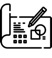
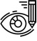
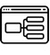
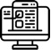

---

layout: default
title: Opdracht 1 - Goal Setting
parent: UX Studio I
permalink: /uxs-01/opdracht-1.html

---

[UX Studio 1 - Opdracht 1 Goal Setting (PDF)](UX Studio 1 - Opdracht 1 Goal Setting.pdf){: .btn }

1. TOC
{:toc}

# Inleiding

Wil je jezelf als ontwerper verder ontwikkelen, zal bijzonder goed van
jezelf moeten weten wie je bent, waar je voor staat en wat jouw
persoonlijke doelen zijn bij een ontwerpproject. Daarnaast is het van
belang dat er een duidelijke klik is tussen jou, je team en de
opdrachtgever. Daarom is het van belang dat je goed kunt motiveren wat
jouw doelen zijn in het designteam, en wat je persoonlijke doelen zijn
voor de komende 20 weken.

# Opdracht

Aan de hand van twee oefeningen ga je voor jezelf een doel stellen voor
het komende semester. Dit kan een professioneel doel zijn, maar ook een
persoonlijk doel. Belangrijk is dat het een doel is waar je jezelf mee
identificeert en waar je jezelf en anderen aan kunt houden. Onderzoek
heeft uitgewezen dat het stellen van doelen en vervolgens de stappen
ondernemen om ze te verwezenlijken leidt tot positieve emoties en als
gevolg daarvan betere studieprestaties!

De volledige oefening bestaat uit twee verschillende delen, elk met een
aantal stappen.

-   In deel 1 schrijf je in het algemeen over je doelen.
    [Download hier deel 1 vanuit SharePoint als Word Document](https://hrnl.sharepoint.com/:w:/s/CMI-IUXD22-23/EbvmsbfO3mdPgvfBEQWJ1oEBxqAZhxyOkSVFvDYde_hd2Q?e=YifSUZ){: .btn .btn-purple }
-   In deel 2 specificeer en verduidelijk je de aard van die doelen en
    begin je een te strategie te vormen.\
    [Download hier deel 2 vanuit SharePoint als Word Document](https://hrnl.sharepoint.com/:w:/s/CMI-IUXD22-23/EWuBtl1USTVLpGhosmMz1doBsxnbG6ML8ecRRfCD1ij4hQ?e=9z8GLb){: .btn .btn-purple }
-   In deel 3 formuleer je een “Ik ga...” statement. 

We raden je aan dat je deze oefening in twee of afzonderlijke dagen
voltooid.

Mensen die zichzelf wat tijd gunnen om te slapen als ze belangrijke
beslissingen moeten nemen, lijken het beter te doen en daar meer van te
profiteren. De gehele oefening duurt ongeveer twee en een half uur.

Op de eerste dag kun je deel 1 voltooien. Op de tweede dag kun je deel 2
voltooien.

Op basis van de uitkomsten van de oefening formuleer je voor jezelf een
"Ik ga... " statement. In dit statement geef je in een of twee zinnen
aan, waar je komend semester voor gaat.

In de praktijk zie je dat het maken van interactieve producten en
diensten een teamsport is. Professionals met verschillende soorten
expertises dragen verschillende verantwoordelijkheden in het
ontwerpteam. Ze zijn in staat om als een team te werken, maar hebben
ieder hun eigen verantwoordelijkheid voor een aspect van het
eindresultaat.

Om de taakverdeling binnen de design teams beter te verdelen en beter
toetsbaar te maken werken we met een aantal vaste verantwoordelijkheden.
Bij de team-assessment aan het eind van het kwartaal wordt iedereen
individueel beoordeeld op het deelaspect waar hij of zij tijdens het
project voor verantwoordelijk is geweest.

Hierbij moet wel opgemerkt worden dat het onvermijdelijk is dat deze
verantwoordelijkheden op verschillende plekken overlappen, je werkt
immers in een team.

Een design team draagt de verantwoordelijkheid voor de volgende
deelgebieden:

-   User Research & Testing

-   Visual Design

-   Interaction Design

-   Creative Technologies & Prototyping

Uiteraard is het van belang dat alle teamleden intensief communiceren over alle aspecten van het ontwerp, maar de uiteindelijke verantwoordelijkheid ligt bij de door jou gekozen eindverantwoordelijkheid. Eindverantwoordelijk wil dus niet zeggen dat je als een silo al het werk naar je toe trekt, maar verantwoordelijk bent voor die specifieke aspecten van de prestatie van het team.

Wat ieder deelgebied precies inhoudt lees je verder in dit document. Bij
ieder deelgebied is er een uitgebreide omschrijving met de bijbehorende
verantwoordelijkheden.

##  User Research & Testing

### Omschrijving

Het project begint met het vaststellen van de doelen van het ontwerp en
de requirements. De eindverantwoordelijke voor user research & testing
praat met de klant en de potentiële gebruikers om deze doelen en
intenties vast te stellen. Ze onderzoeken en definiëren de ontwerpdoelen
en de criteria voor een succesvol product. Daarnaast spelen ze een
coördinerende rol waarbij zij verantwoordelijk zijn voor Quality Control
(QA), en het bewaken van de doelgerichtheid van het team.

Vragen waar de verantwoordelijke voor de user research & testen tijdens
het project antwoord op moet geven:

-   Wat zijn de zakelijke intenties achter het product? Welke zakelijk
    doelen heeft jouw opdrachtgever voor ogen met het project?

-   Wat zijn de werkelijke doelstellingen van het product rekening
    houdend met het perspectief van de gebruikers en de klant?

-   Heeft de klant het bij het juiste eind? Hebben ze de juiste keuzes
    gemaakt? Is dit product werkelijk wat ze zouden moeten maken? De
    ontwerpideeën en concepten, zijn die juist georiënteerd voor het
    project?

-   Doet iedereen zijn werk juist? Doet iedereen wat hij/zij zou moeten
    doen en voeren ze deze taken op een juiste manier met elkaar uit?

-   Is de kwaliteit van alles wat geproduceerd wordt van een hoog
    niveau? Hier is testen zéér belangrijk. Testen van prototypes,
    concepten waardeproposities etc. Het valideren van het product.

-   Worden de succescriteria behaald?

## Visual Design

### Omschrijving

De eindverantwoordelijke voor het visual design is verantwoordelijk voor
het visuele ontwerp van zowel interne presentaties als het visuele
ontwerp van het definitieve op te leveren product / prototype. Hierbij
staat de visuele communicatie met de eindgebruiker en de opdrachtgever
centraal.

Vragen waar de eindverantwoordelijke voor het visual design tijdens het
project antwoord op moet geven:

-   Op welke wijze wordt de boodschap van de opdrachtgever visueel
    gecommuniceerd?

-   Hoe zou het product er uit moeten zien?

-   Hoe ziet het product er uit en waarom ziet het er zo uit?

-   Past het product bij het merk (indien er sprake is van een merk)

-   Roept het product de juiste emoties en ideeën op bij de gebruikers?

Een product heeft een overduidelijke esthetische beleving. Dit komt
direct tot uiting in de visuele uitwerking van het product, maar hou er
ook rekening mee dat animaties, illustraties en infographics ook een
belangrijk onderdeel vormen van hedendaagse interactieve producten en
diensten.

## Interaction Design

### Omschrijving

Het Interaction Design vormt de blauwdruk voor het volledige
product/dienst. Daarnaast is de eindverantwoordelijke voor het
Interaction Design ook de advocaat van de gebruiker. Dit houdt in dat er
onderzoek gedaan moet worden naar gebruikers, profielen van gebruikers
opgesteld moeten worden, maar ook wireframes, flowcharts en alle andere
middelen gerealiseerd moeten worden om zo een complete blauwdruk te
maken van de gebruiker en het product.

Vragen waar de eindverantwoordelijke voor het Interaction Design tijdens
het project antwoord op moet geven:

-   Wat is het profiel van de toekomstige gebruiker? Waar zijn ze naar
    op zoek? Wat zijn hun behoeftes, qua informatievoorziening en op
    andere wijze(s) ?

-   Hoe ziet de blauwdruk van dit product er uit? Hou er rekening mee
    dat jij bepaalt welke blauwdruk het best van toepassing is voor het
    realiseren product. Dit kunnen wireframes zijn, flowcharts of andere
    deliverables.

-   Hoe gaan mensen het product gebruiken? Hierbij draait het vooral om
    de gedachten, ideeën en reacties van mensen die het product
    gebruiken.

Denk aan deliverables zoals scenario's, user stories of bijvoorbeeld een
task flow. Ook hier ben je vrij in je keuze van middelen / deliverables,
zolang ze maar antwoord geven op de vraag *'Hoe gaan mensen het product
gebruiken?'*

## Creative Technologies & Prototyping

### Omschrijving

De eindverantwoordelijke voor het prototype bouwt werkende low- tot en
met high fidelity prototypes gedurende het gehele project. Hiermee kan
iedereen tijdens het project het product beleven zodat iedereen (zowel
binnen het team als daarbuiten) begrijpt wat er wel en/of niet werkt.

Vragen waar het prototype tijdens het project antwoord op moet geven:

-   Hoe moet het écht werken voor gebruikers, en werkt het zoals het zou
    moeten?

-   Heeft het product de karakteristieken van goed interaction design
    zoals gedefinieerd door Dan Saffer in [Designing for Interaction](https://www.bol.com/nl/nl/p/designing-interaction/1001004006819488/?Referrer=ADVNLGOO002008N-G-136951994761-S-852446780390-1001004006819488&gclid=CjwKCAjwyryUBhBSEiwAGN5OCOKdYI0DHbSpvWFTIzNkJpKisX0Iz4TxtI_-sU8-1K0jcAWttuPyDRoCpBEQAvD_BwE)?

-   Is de interactie met de gebruiker zonder hickups? Is het vloeiend?

-   Andere karakteristieken die van toepassing zijn: Is de interactie
    van toepassing? Is het responsief? Kan de gebruiker veilig
    verkennen?

# Taakverdeling

Dit is een omschrijving van de vier verantwoordelijkheden. Uiteraard is
het van belang dat alle teamleden intensief communiceren over alle
aspecten van het ontwerp, maar de uiteindelijke verantwoordelijkheid
ligt bij de door jou gekozen eindverantwoordelijkheid.
Eindverantwoordelijk wil dus niet zeggen dat je als een silo al het werk
naar je toe trekt, maar verantwoordelijk bent voor die specifieke
aspecten van de prestatie van het team.

## Deadline

Je "ik ga" statement lever je uiterlijk op **zondag 4 september** om
**20:00** in week 1 op via MS Forms op MS Teams.

[‘Ik ga statement’ - Formulier](https://forms.office.com/r/RvPe27Rv9D){: .btn .btn-green }

# Opleveren

Je levert je "Ik ga" statement op via MS Forms op MS Teams.

# Toetsing

Deze opdracht wordt formatief getoetst. Je projectbegeleider kijkt of je
kunt kunt uitleggen waarom je voor een specifieke verantwoordelijkheid
binnen het ontwerpteam kiest, waarom deze bij je past en wat jij met
deze opdracht wil bereiken. Tijdens het project zal je op specifieke
moment gevraagd worden om te kijken of je nog steeds de doelen behaalt
die je voor jezelf gesteld hebt.

[UX Studio 1 - Opdracht 1 Goal Setting (PDF)](UX Studio 1 - Opdracht 1 Goal Setting.pdf){: .btn }